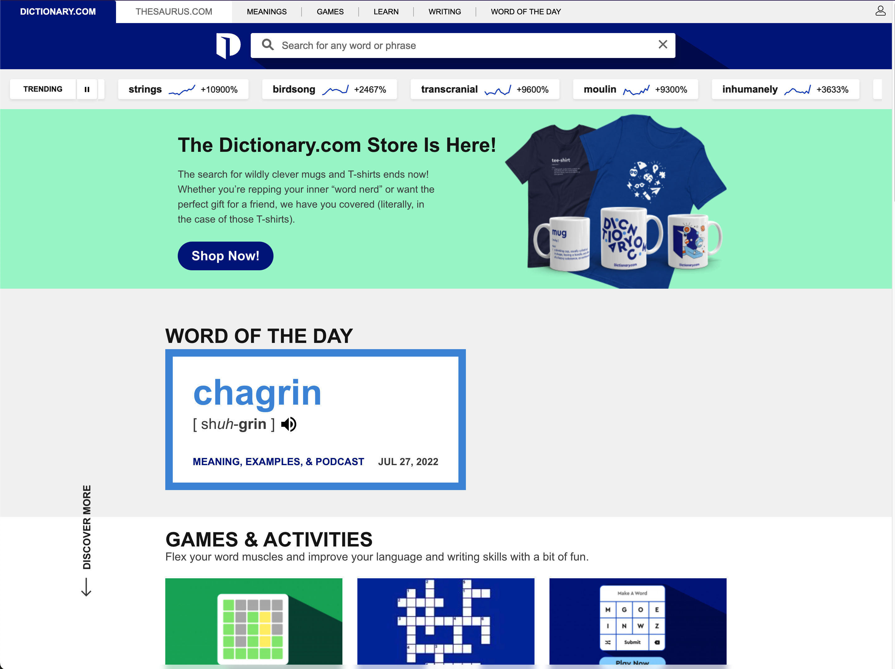

# SeleniumEngine
An AutoPkg url provider that can crawl more complex websites than the built in command which relies on CURL.
&nbsp;
> **Caution**: Using the Selenium processor allows python script to execute locally on the system.  When using this processor, be sure you understand and have vetted each of the commands that will be run.

## History
AutoPkg's native URLDownloader processor relies on curl commands being able to simply read the source code for website called via HTTP GET request. Certain websites, however, will hide their download links/urls behind pop-up windows or other techniques. SeleniumEngine aims to allow for admins to intelligently anticipate many of those hurdles and retrieve download urls that would previously have been inaccessible via autopkg recipes. Take the below example.
&nbsp;

## Example Use Case
You browse to dictionary.com and due your normal browser settings, you see the page normally.



When your autopkg URLTextSearcher pulls the website, however, it hits a popup.


You do some digging and find that you can just inject search term into the url, so you load that. However you occassionally, but only occassionally hit a second popup.


SeleniumEngine allows recipes to search a website's HTML to impersonate an active user session, by clicking through popups when displayed, or otherwise navigating a site where, for example, a search term needs to be entered, or a drop down menu needs to be used.

## Basic Concepts
After installation, run the following for variable details
```bash
autopkg processor-info Selenium
```
When initialized, the processor creates a few objects for use during its run.
- **browser**: This is a Chrome webdriver object from the Selenium module.
- **keypress**: This is a utility object from the root webdriver object that can be used to insert key presses for ENTER/RETURN, etc. For example:
	* keypress.ENTER
	* keypress.ESCAPE
- **time**: A time object, primarily intended to enable waiting for a short period of time. For example:
	* time.sleep(5.0)
- **fnmatch**: A utility object to allow regex/wildcard matching. For example:
	* fnmatch.fnmatch('myString','*ring') => True

## Installation
```bash
autopkg run SeleniumEngine.install
```
### Basic Use

If not otherwise defined in the processor, SeleniumEngine will return the text of the page source of the last url called by the browser object. The **selenium_commands** array in the autopkg processor arguments will perform regex matching/transformations using the code written by [Greg Neagle, Timoty Sutton,Per Olofsson, and Michael Moravec](https://github.com/autopkg/autopkg/wiki/Processor-URLTextSearcher).

[Example Recipe](docs/samples/selenium-sample.recipe)


## Other Notes
- Examples in this readme and the provided sample recipe purposefully do not use any known software vendor. The thinking behind this is that generally these vendors have made conscious decisions to 'hide' their publicly available installers specifically to evade programmatic retrieval, and that exposing the techniques used by a recipe to get around these may trigger the web developers to re-work their sites to again get around this, which would likely require any dependant recipes to require updates again.